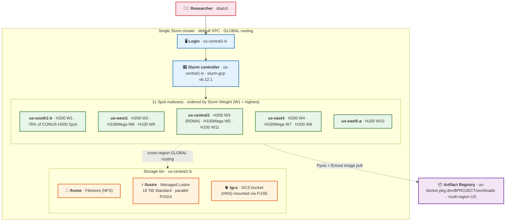

# Multi-region Slurm reference deployment


A reference Slurm + GPU cluster on Google Cloud that fans Spot capacity across multiple CONUS regions and uses Pyxis/Enroot containers as the workload-delivery primitive. Built for an HPC admin standing up a CUI enclave for scientific GPU researchers.

## Architecture at a glance

- **Controller**: us-central1-b, `n2-standard-16`, no public IP (IAP-SSH only)
- **Login**: us-central1-b, `n2-standard-4`, no public IP
- **Storage**: Filestore (`/home`) + Managed Lustre 18 TiB (`/lustre`) + GCS bucket with HNS (`/gcs`), all in us-central1, all reachable from every nodeset over the default VPC's GLOBAL routing
- **Container catalog**: Multi-region US Artifact Registry Docker repo at `us-docker.pkg.dev/$PROJECT/workloads/`, populated by admin `gcloud builds submit` calls; cross-region nodes pull from the nearest mirror
- **11 Spot nodesets** spread across us-central1, us-south1, us-west1, us-east4, us-east5 — single `gpu` partition, ordered by Slurm `Weight` (W1 = top priority). See `blueprints/cluster.yaml:663-687` for the source of truth.




## Step-by-step deployment

### Step 1 — Local toolchain + GCP project prep (~10 min, admin, idempotent)

```bash
./scripts/setup-project.sh
```

What it does against the GCP project:

1. Install Terraform + Packer at the versions Cluster Toolkit pins
2. Enable the GCP APIs the cluster + container build path need
3. Apply org policies
4. Grant the default Compute SA the IAM roles the cluster + Cloud Build path need
5. Create the multi-region US Artifact Registry Docker repo for workload containers
6. Trigger the Lustre service-account identity
7. Wire the network for cross-region, no-public-IP cluster traffic — GLOBAL VPC routing, Cloud NAT per nodeset region, IAP-SSH ingress, immutable audit-log sink
8. Print current GPU quotas in the H200-bearing regions

This puts the project at the **NIST 800-171 baseline + 6 hardening upgrades** documented in [`docs/nist_800_171_hardening.md`](docs/nist_800_171_hardening.md):

| Hardening upgrade                                  | NIST §                       | Where it lives                          |
| :------------------------------------------------- | :--------------------------- | :-------------------------------------- |
| Shielded VM (vTPM + integrity-monitoring)          | §3.4.6, §3.14.1              | every `enable_shielded_vm: true` block in `cluster.yaml` |
| OS Login project-wide (Google identity → Linux user) | §3.5.1, §3.5.2, §3.5.3 (MFA) | `setup-project.sh` step 7 + `enable_oslogin: true` on every VM module |
| No public IPs on any cluster VM                    | §3.13.1                      | `enable_public_ips: false` on every nodeset/login/controller; SSH via IAP |
| Cloud NAT in every nodeset region                  | §3.13.1                      | `setup-project.sh` step 7 (5 routers + 5 NATs) |
| Serial port access disabled                        | §3.4.6, §3.4.7               | org-level `compute.disableSerialPortAccess` |
| Write-only audit log sink                          | §3.3.8, §3.3.9               | `setup-project.sh` step 7 (400-day retention bucket) |
| VPC Service Controls perimeter — *deferred*        | §3.1.3, §3.13.1              | org-level, owned by the customer's central security team |

### Step 2 — Build custom Lustre Slurm image (~35 min, admin, one-time per image revision)

```bash
cd cluster-toolkit && make && cd ..
cluster-toolkit/gcluster create blueprints/build-lustre-image.yaml --out . -w
cluster-toolkit/gcluster deploy wzslurm-img --auto-approve
```

**Why a custom image** — slurm-gcp's public image ships `lustre-client-modules-5.15.0-88-generic` but boots `6.8.0-1047-gcp`, and Cluster Toolkit's `install-managed-lustre-client.sh` short-circuits when it sees `lustre` in `/proc/filesystems`, so matching kernel modules never get installed → `mount.lustre` fails. The Packer build solves this at image-build time, plus adds the container runtime that the public image lacks.

### Step 3 — Deploy the cluster (~15 min, admin, one-time)

```bash
cluster-toolkit/gcluster create blueprints/cluster.yaml \
  -d blueprints/cluster-deployment.yaml --out . -w
cluster-toolkit/gcluster deploy my-slurm --auto-approve
```

What comes up:
- Controller (`wzslurm-controller`, us-central1-b)
- Login (`wzslurm-slurm-login-001`, us-central1-b)
- Lustre (18 TiB Standard tier, us-central1-b, `lustrefs` filesystem)
- Filestore (`/nfsshare`, us-central1-b)
- GCS bucket with Hierarchical Namespace
- 11 nodesets registered with Slurm `Weight`, all powered down (`idle~`)

Verify:
```bash
gcloud compute ssh wzslurm-slurm-login-001 --zone=us-central1-b --tunnel-through-iap --command='sinfo -N'
gcloud lustre instances list --location=us-central1-b
mount | grep -E '/home|/lustre|/gcs'   # on controller, all three mounted
```

### Step 4 — Stage a workload (~10-30 min per workload, admin, one-time per stack version)

This is the step that makes the researcher's `sbatch` "just work." Two artifacts per workload:

**(a) Container image — code + python deps, pushed to Artifact Registry.** Define a Dockerfile that layers your workload's deps over an ABI-pinned PyTorch base (e.g. `pytorch/pytorch:2.5.1-cuda12.4-cudnn9-runtime` for PyG-based workloads). Build + push with Cloud Build:

```bash
cd /home/$USER/tests/containers/<workload>/
gcloud builds submit --config=cloudbuild.yaml .
```

**(b) Large data inputs — pre-staged to `/lustre/<workload>/`** so every job reads them once cross-region (parallel POSIX bulk read) instead of re-downloading from GCS. Anything > a few GB belongs here; anything < 1 GB can live in the container image instead.

For the **Cellular Interaction Foundation Model from CalTech (CIFM)** 1B reference workload that ships with this repo, the container is at `tests/containers/cifm/` and the SBATCH at `tests/jobs/example.sh`.

### Step 5 — Capacity-allocation cron polls (~5 min, admin, ongoing)

On the controller:

```cron
0 6 * * *  /opt/my-slurm/scripts/calendar-poll.sh >> /var/log/calendar-poll.log 2>&1
5 6 * * *  /opt/my-slurm/scripts/flex-poll.sh    >> /var/log/flex-poll.log 2>&1
```

`calendar-poll.sh` queries `gcloud compute advice calendar-mode` for 5 SKUs × 5 regions, prints `BOOKABLE` lines per opportunity. `flex-poll.sh` scans 8 (SKU, zone) tuples for DWS Flex-Start eligibility, skips ones with a PROVISIONING reservation already in flight. Both default to dry-run; set `CALENDAR_AUTOBOOK=1` / `FLEX_SUBMIT=1` in cron to upgrade them to actually-book.

When a poll books a Calendar or Flex reservation, the admin defines a new nodeset block in `cluster.yaml` with `reservation_name: my-cal-XXX` and uncomments its entry in `gpu_partition.use:` above the Spot list. Researchers' `sbatch` then automatically lands on the non-preemptible reservation first.

Full 3-task strategy + daily-poll strategy: [`docs/capacity_strategy.md`](docs/capacity_strategy.md).

### Step 6 — Researchers submit jobs (every researcher, every job, seconds)

```bash
gcloud compute ssh wzslurm-slurm-login-001 --zone=us-central1-b --tunnel-through-iap
sbatch /home/$USER/tests/jobs/example.sh
```

The `gpu` partition's `use:` list orders nodesets by Slurm `Weight` (lower = higher priority); see `blueprints/cluster.yaml:663-687` for the live mapping.

Researcher knobs:
- Default `sbatch script.sh` — Slurm picks the highest-priority nodeset that has free capacity.
- SKU filter: `sbatch --constraint=h200 script.sh` (or `h100mega`, `h100`).
- Pin a specific nodeset: `sbatch --nodelist=wzslurm-h200spotsouthb-0 script.sh`.
- Multi-node H200 RDMA training: `sbatch --constraint=h200,rdma -N 2 script.sh` (only the in-region us-central1-b H200 nodeset has the RDMA secondary attached).

### Step 7 — Test the deployment (admin, once per cluster)

The repo ships one example workload — Caltech's CIFM 1B inference — to exercise the deployment end-to-end.

**Build + push the CIFM container** from the controller:

```bash
gcloud compute ssh wzslurm-controller --zone=us-central1-b --tunnel-through-iap
cd /home/$USER/tests/containers/cifm/
gcloud builds submit --config=cloudbuild.yaml .
```

`cloudbuild.yaml` runs two steps in Cloud Build's managed VM: (1) `gcloud storage cp` the workload tarball from `gs://cifm-staging/code/`, (2) `docker build` against the local Dockerfile + entrypoint, push to `us-docker.pkg.dev/$PROJECT/workloads/cifm:v1`. ~6 GB compressed.

**Submit the test job** from the login VM:

```bash
gcloud compute ssh wzslurm-slurm-login-001 --zone=us-central1-b --tunnel-through-iap
sbatch /home/$USER/tests/jobs/example.sh
```

What `example.sh` does:
- **First-job-on-cluster lazy-stages** the 11.6 GB model + 45 MB tissue + threshold from `gs://cifm-staging/data/` to `/lustre/cifm/` (idempotent — every subsequent job and every requeue skips it)
- Authenticates Enroot to Artifact Registry by writing the VM SA's metadata-server access token to `~/.config/enroot/.credentials` (netrc format)
- `srun --container-image=docker://us-docker.pkg.dev#$PROJECT/workloads/cifm:v1` — Pyxis pulls + caches the image on local SSD on first run; `--container-mounts` bind-mounts `/lustre/cifm/model_checkpoints` over the container's read-only package-relative dir, plus `/tmp` for a writable HOME
- Runs **STEPS=10000** × ~6.5 min/step on H200 with `--time=UNLIMITED` — open-ended so Spot preempts get exercised naturally over a long horizon; set `STEPS=10` for a one-shot sanity check (~65 min)
- On preempt, `--requeue` brings the same JobId up on the next-Weight free nodeset; the workload's resume logic reads the highest `checkpoint_step{N}.npy` in `/lustre/checkpoints/$SLURM_JOB_ID/` and picks up at step `N+1`. `SLURM_RESTART_COUNT > 0` confirms the path fired.

## Researcher quick reference (the SBATCH contract)

| Path                                          | Purpose                                                                  |
| :-------------------------------------------- | :----------------------------------------------------------------------- |
| `/home/$USER/...`                             | Researcher code + personal env (Filestore NFS, persistent across requeues) |
| `/lustre/<workload>/...`                      | Admin-staged large data inputs (model weights, datasets)                 |
| `/lustre/checkpoints/$SLURM_JOB_ID/`          | Researcher writes per-step checkpoints here (parallel POSIX, persists)   |
| `/gcs/runs/$SLURM_JOB_ID.out`                 | Researcher's stdout (durable archive)                                    |
| `docker://us-docker.pkg.dev#$PROJECT/workloads/<name>:<tag>` | Container image — reference in `srun --container-image=...`. Enroot's URI syntax uses `#` between hostname and path; without it Pyxis routes to Docker Hub and 401s. |

Always include `#SBATCH --requeue`.

## Operational rhythm

| When                         | What                                                                    | Owner       |
| :--------------------------- | :---------------------------------------------------------------------- | :---------- |
| 06:00 UTC daily              | `calendar-poll.sh` — grab any > 7-day Calendar window                   | Admin (cron) |
| 06:05 UTC daily              | `flex-poll.sh` — submit Flex-Start per eligible (SKU, zone) pair        | Admin (cron) |
| Per researcher submit        | `sbatch -p gpu script.sh` → Slurm picks highest-Weight free nodeset     | Researcher  |
| Per Spot preemption          | `--requeue` → resume hook on new VM picks up from latest `/lustre` checkpoint | Slurm + workload |
| Weekly                       | Audit Calendar reservations, cancel ones not consumed by half their window | Admin       |
| Per stack-version bump       | Edit Dockerfile, `gcloud builds submit --config=cloudbuild.yaml --substitutions=_IMAGE_VERSION=v(N+1) .`, tell researchers | Admin       |

## Tear down

```bash
./scripts/destroy.sh
```

Runs `gcluster destroy` then sweeps stragglers (instances, disks, GCS, Filestore, Lustre, networks).

## File layout

```
.
├── README.md                              # this file
├── docs/
│   ├── success_checklist.md               # verified-checks + known blockers + remediation
│   ├── capacity_strategy.md               # Calendar/Flex/Spot 3-task strategy
│   └── nist_800_171_hardening.md          # 6 hardening upgrades + § mapping
├── cluster-toolkit/                       # vendored Google Cluster Toolkit (git submodule)
├── blueprints/
│   ├── build-lustre-image.yaml            # Packer image build (Lustre + CUDA + NCCL + Pyxis/Enroot)
│   ├── cluster.yaml                       # Slurm + storage + 11 nodesets + Weights
│   └── cluster-deployment.yaml            # per-deployment vars
├── scripts/
│   ├── setup-project.sh                   # one-time GCP project + local toolchain prep + Artifact Registry repo
│   ├── calendar-poll.sh                   # daily Calendar Mode poll (cron)
│   ├── flex-poll.sh                       # daily Flex-Start poll (cron)
│   └── destroy.sh                         # gcluster destroy + manual sweep
└── tests/
    ├── containers/
    │   └── cifm/
    │       ├── Dockerfile                 # CIFM container: pytorch base + scanpy + PyG + workload code
    │       ├── entrypoint.sh              # bridges /lustre/cifm/* to gpu_run.py's expected paths
    │       └── cloudbuild.yaml            # Cloud Build pipeline: gcs cp → docker build → Artifact Registry push
    ├── jobs/
    │   ├── example.sh                     # canonical reference SBATCH (CIFM 1B, STEPS=10000, no time wall, container + lustre)
    │   ├── test_h200_e2e.sh               # 30-min H200 + 3-mount smoke test
    │   ├── test_spot_preemption.sh        # 12h job demonstrating preempt-resume
    │   └── run_e2e_direct_h200.sh         # non-Slurm fallback (legacy)
    └── scripts/
        ├── test_h200_inference.py         # H200 detection + matmul helper
        └── test_long_inference.py         # checkpointing loop for preemption test
```

## References

- [`docs/success_checklist.md`](docs/success_checklist.md) — verified-checks list + known blockers + remediation
- [`docs/capacity_strategy.md`](docs/capacity_strategy.md) — Calendar / Flex / Spot 3-task daily-poll strategy + daily-poll strategy
- [`docs/nist_800_171_hardening.md`](docs/nist_800_171_hardening.md) — hardening upgrades with NIST § mapping
- [NVIDIA Pyxis](https://github.com/NVIDIA/pyxis) — SLURM SPANK plugin for unprivileged container execution
- [NVIDIA Enroot](https://github.com/NVIDIA/enroot) — unprivileged container runtime used by Pyxis
- [`WandLZhang/caltech-ci-fm-gpu`](https://github.com/WandLZhang/caltech-ci-fm-gpu) — example CIFM 1B inference workload
- [`GoogleCloudPlatform/cluster-toolkit`](https://github.com/GoogleCloudPlatform/cluster-toolkit)
