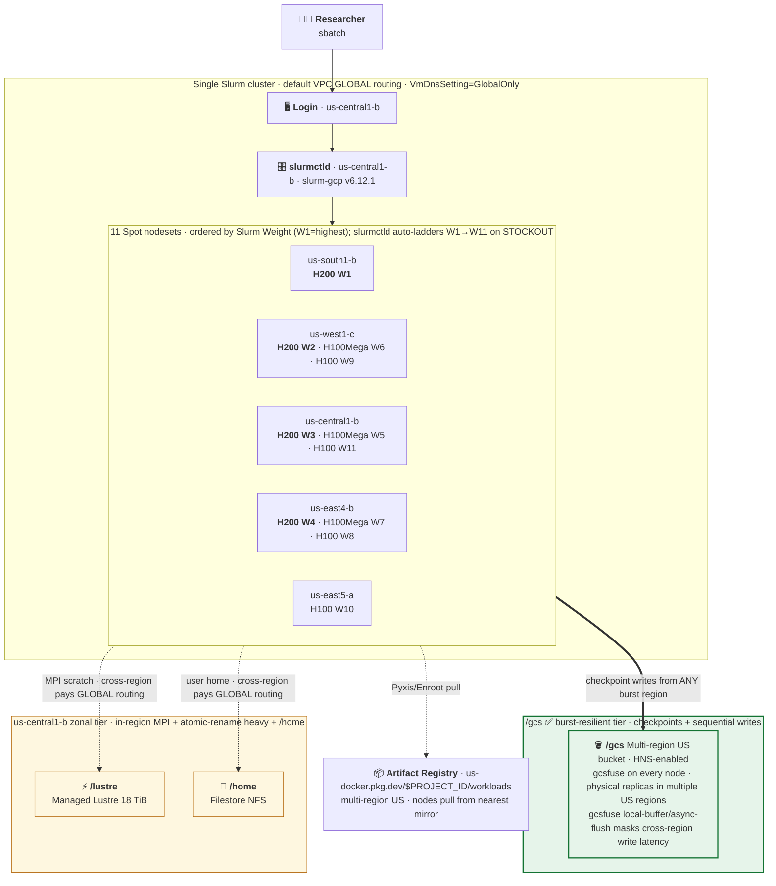

# Multi-region Slurm reference deployment

> **Slides** — high-level walkthrough deck: [live](https://shiny-broccoli-zgeow24.pages.github.io/slides.html) · [source](slides/slides.md)

A reference Slurm + GPU cluster on Google Cloud that fans Spot capacity across multiple CONUS regions and uses Pyxis/Enroot containers as the workload-delivery primitive. Built for an HPC admin standing up a CUI enclave for ~15 scientific GPU researchers, demonstrated with two example workloads that survive Spot preempts via Slurm `--requeue`:

- **nanoGPT training** (Step 6/7) — checkpoints to **/gcs** (multi-region bucket — the burst-resilient tier)
- **TinyLlama batch inference** (Step 8) — checkpoints to **/lustre** (Managed Lustre — the parallel-POSIX tier)

## Architecture at a glance

- **Controller**: us-central1-b, `n2-standard-16`, no public IP (IAP-SSH only)
- **Login**: us-central1-b, `n2-standard-4`, no public IP
- **Storage** — tier matched to workload pattern:
  - **`/gcs`** — multi-region US bucket (HNS), mounted via Cloud Storage FUSE on every node. **The right tier for multi-region Spot burst workloads** (checkpoint/resume across regions) — the bucket is reachable from every burst region, so when a Spot preempt lands the requeue on a different region the new VM reads the checkpoint from its closest physical replica. Pair with [Rapid Cache](https://docs.cloud.google.com/storage/docs/rapid/rapid-cache) for zonal SSD read caching on hot paths.
  - **`/lustre`** — Managed Lustre 18 TiB Standard, zonal in us-central1-b. The right tier for **tightly-coupled MPI in-region** (GROMACS, NAMD, AMBER) where the access pattern is concurrent per-rank writes co-located with compute. Not the right choice for multi-region burst.
  - **`/home`** — Filestore (NFS), us-central1-b. Researcher home dirs.
- **Container catalog** — Multi-region US Artifact Registry Docker repo at `us-docker.pkg.dev/$PROJECT_ID/workloads/`, populated by admin `gcloud builds submit` calls; cross-region nodes pull from the nearest mirror.
- **11 Spot nodesets** spread across us-central1, us-south1, us-west1, us-east4, us-east5 — single `gpu` partition, ordered by Slurm `Weight` (W1 = top priority). When a higher-priority nodeset is unavailable (Spot stockout, capacity exhausted), slurmctld auto-ladders to the next-Weight nodeset with zero manual intervention. Source of truth: `gpu_partition.use:` block in [`blueprints/cluster.yaml`](blueprints/cluster.yaml).



**Reading the diagram.** Slurmctld picks nodesets by `Weight` (lower wins); the auto-ladder fires unaided when a zone hits Spot `STOCKOUT`. Compute in any of the 5 burst regions writes checkpoints to `/gcs` — the multi-region bucket physically replicates across multiple US regions, and gcsfuse on the compute node returns writes from a local buffer (async-flush in the background), so cross-region write latency is hidden from the workload. `/lustre` and `/home` are zonal in us-central1; reads/writes from a non-central1 compute VM route over the default VPC's GLOBAL BGP and pay full RTT every time.

---

## Which tier should I use for MY job?

Pick by your job's dominant access pattern, **not by the example workloads** in this README. The two examples each pick one tier *to demonstrate that tier works* — they are not recommendations for what your job should pick. Use this table:

| Question about your workload                                                    | If yes → use |
| :------------------------------------------------------------------------------ | :----------- |
| It may requeue to a different region after Spot preempt                         | **`/gcs`**   |
| Writes are sequential appends (stdout, logs, results.jsonl, per-step ckpts)     | **`/gcs`**   |
| Read-heavy dataset gets reused across regions (cross-region cache benefits it)  | **`/gcs`** + [Rapid Cache](https://docs.cloud.google.com/storage/docs/rapid/rapid-cache) |
| Writes are atomic-rename heavy (database WAL, etcd, frequent lockfile churn)    | **`/lustre`** |
| Tightly-coupled MPI with concurrent per-rank writes from many nodes in one region | **`/lustre`** |
| Read-heavy dataset is hot in one region (cryo-EM particle stacks, training shards) | **`/lustre`** + pre-stage |
| I genuinely don't know                                                          | **`/gcs`** (cheaper, harder to misuse for burst) |

Measured per-prompt latencies + cost analysis: [`docs/storage_comparison.md`](docs/storage_comparison.md). Headline: `/gcs` wins for cross-region burst (~25% faster end-to-end + ~4 orders of magnitude cheaper at our checkpoint scale); `/lustre` wins for in-region atomic-rename and tightly-coupled MPI patterns.

---

## Prerequisites (one knob: your GCP project)

Everything in this repo reads from your active `gcloud` config — there are no project IDs to edit in any file. **Run these three commands first:**

```bash
# Point gcloud at the project you want to deploy into
gcloud config set project YOUR_PROJECT_ID

# Authenticate for Application Default Credentials (needed by Terraform/Packer)
gcloud auth application-default login
gcloud auth application-default set-quota-project YOUR_PROJECT_ID

# Used by every gcluster command below
export PROJECT_ID=$(gcloud config get-value project)
echo "Targeting project: $PROJECT_ID"
```

**The project must already exist with billing enabled** — this repo does not create it. If you're starting from a fresh project, also enable the Cloud APIs that you'd need to even check the project:

```bash
gcloud services enable compute.googleapis.com cloudbilling.googleapis.com --project=$PROJECT_ID
```

**Local tools.** Linux/macOS workstation with:
- `gcloud` (Google Cloud SDK)
- `git`
- **Terraform 1.12.2 exact** — Cluster Toolkit v1.90.0 requires this exact version. On macOS the script auto-installs via `tfenv`/Homebrew; on Linux, download from [releases.hashicorp.com](https://releases.hashicorp.com/terraform/1.12.2/) and put it on `$PATH`.
- **Packer ≥ 1.15** — same install pattern as Terraform.

**Clone this repo + initialize the vendored Cluster Toolkit submodule** (a plain `git clone` does **not** pull the submodule):

```bash
git clone https://github.com/cloud-gtm/slurm-multi-region-gpu.git
cd slurm-multi-region-gpu
git submodule update --init
```

---

## Step 1 — Bootstrap the GCP project (~10 min, idempotent)

```bash
./scripts/setup-project.sh
```

This script enables 11 APIs, applies org-policy bypasses, grants IAM, triggers the Lustre service identity, creates the default VPC if absent, sets `VmDnsSetting=GlobalOnly` (critical — without it, cross-region slurmctld→slurmd resolution fails with `getaddrinfo: Name or service not known`), creates a Cloud Router + NAT per region, creates a write-only audit log sink, and prints GPU quotas.

**Verify:** the last lines of output show `Done.` and current GPU quotas for us-central1 + us-south1.

> **Heads-up on H100/H200 quota.** A fresh project may have **zero** preemptible H100/H200 quota. The cluster will still deploy (and idle nodesets register), but `sbatch` will hang on bulkInsert until quota is granted. Request quota *before* Step 6 if you don't already have it; see [Cloud Console → IAM & Admin → Quotas](https://console.cloud.google.com/iam-admin/quotas) and filter `PREEMPTIBLE_NVIDIA_H200_GPUS`.

## Step 2 — Build the custom Lustre Slurm image (~35 min, one-time per image revision)

```bash
cd cluster-toolkit && make && cd ..   # builds the gcluster binary

cluster-toolkit/gcluster create blueprints/build-lustre-image.yaml \
  --vars project_id=$PROJECT_ID --out . -w

cluster-toolkit/gcluster deploy wzslurm-img --auto-approve
```

This blueprint defines exactly two deployment groups (`image-env` + `image`), so `--auto-approve` builds **only** the Packer image — it does not stand up a cluster. Expect ~5 min for VPC/NAT/firewall + ~30 min for the Packer build (Ansible playbook, CUDA toolkit, NCCL, Pyxis/Enroot, Managed Lustre client kmod).

**Verify the image is READY:**
```bash
gcloud compute images list --project=$PROJECT_ID --filter='family:wzslurm-img-u22' \
  --format='table(name,family,status)'
# expected: STATUS=READY
```

## Step 3 — Deploy the cluster (~15 min, one-time)

```bash
cluster-toolkit/gcluster create blueprints/cluster.yaml \
  -d blueprints/cluster-deployment.yaml --vars project_id=$PROJECT_ID --out . -w

cluster-toolkit/gcluster deploy wz-slurm --auto-approve
```

What comes up:
- Controller (`wzslurm-controller`, us-central1-b)
- Login (`wzslurm-slurm-login-001`, us-central1-b)
- Filestore (`/nfsshare` → `/home`, us-central1-b)
- Managed Lustre 18 TiB (`/lustrefs` → `/lustre`, us-central1-b)
- GCS bucket with Hierarchical Namespace (`/gcs`)
- 11 nodesets registered with Slurm `Weight`, all powered down (`idle~`)

**Verify (give slurmctld ~2 min to come up):**
```bash
gcloud compute ssh wzslurm-slurm-login-001 --zone=us-central1-b \
  --tunnel-through-iap --project=$PROJECT_ID --command='sinfo -N'
# expected: 11 rows, all STATE=idle~
```

## Step 4 — Build the example nanoGPT workload container (~2 min)

This builds a self-contained container — public nanoGPT code cloned at build time, tinyshakespeare vendored and tokenized into the image, model trained from scratch. **No private buckets, no logins, no model downloads** — any user in any project can build it.

```bash
cd tests/containers/nanogpt
gcloud builds submit --config=cloudbuild.yaml --project=$PROJECT_ID .
cd ../../..
```

**Verify the image landed in your Artifact Registry:**
```bash
gcloud artifacts docker images list us-docker.pkg.dev/$PROJECT_ID/workloads \
  --include-tags --filter='package~nanogpt' --format='table(package,tags,createTime)'
# expected: nanogpt :v1 with a recent createTime
```

## Step 5 — Copy the test scripts onto the cluster (~30 sec)

The repo isn't yet on the cluster's `/home`. Copy `tests/` to the login VM's `$HOME` (which is the shared Filestore — controller and every compute node will see it):

```bash
gcloud compute scp --recurse --tunnel-through-iap --zone=us-central1-b \
  --project=$PROJECT_ID tests wzslurm-slurm-login-001:~/tests
```

## Step 6 — Submit a training job and watch it write checkpoints (~10-15 min)

```bash
# Open a session on the login VM
gcloud compute ssh wzslurm-slurm-login-001 --zone=us-central1-b \
  --tunnel-through-iap --project=$PROJECT_ID

# (on login VM) submit a long enough run that we'll have time to test preempt
chmod +x ~/tests/jobs/example.sh
sbatch --export=ALL,MAX_ITERS=20000 ~/tests/jobs/example.sh
squeue   # job ID printed by sbatch, status=CF (configuring)
```

**What's happening behind the scenes:**
1. `slurmctld` picks the lowest-Weight idle nodeset (W1 us-south1-b) and calls slurm-gcp's `ResumeProgram`, which makes a `bulkInsert` Compute Engine API call for an a3-ultragpu-8g (8×H200) Spot VM in that zone.
2. **If the zone has Spot capacity:** the VM is created from the custom image you built in Step 2, slurmd starts, registers with the controller (cross-region resolution works because Step 1 set `VmDnsSetting=GlobalOnly`), and the job goes from `CF` → `R`.
3. **If the zone is stocked out** (`ZONE_RESOURCE_POOL_EXHAUSTED`): slurmctld marks the nodeset `DOWN` with the GCE error as the reason, and **auto-ladders** to the next-Weight nodeset (W2 us-west1-c) on its next scheduling pass — no manual intervention.
4. Once the job is running, the entrypoint pulls the nanoGPT container from your Artifact Registry (cached on local SSD after first pull), then `torchrun --nproc_per_node=8 train.py` starts training, checkpointing `ckpt.pt` to `/gcs/checkpoints/$SLURM_JOB_ID/` every `eval_interval` steps.

**Verify (also on the login VM, ~10 min after `sbatch`):**

```bash
# Job should be R; if still CF after 10 min, check `scontrol show node` for stockouts
squeue

# First ckpt.pt lands on /gcs at iter 50 (~30s of training after the node boots)
JOB=$(squeue -h -o %i | head -1)
ls -lh /gcs/checkpoints/$JOB/   # expect ckpt.pt ~120MB

# Training is actually progressing (loss decreasing)
tail -20 /gcs/runs/nanogpt-${JOB}.out
# expect lines like: "step 100: train loss 2.39, val loss 2.43" and "saving checkpoint to /gcs/checkpoints/N"
```

## Step 7 — Simulate a Spot preempt and verify the job resumes (~10 min after preempt)

This is the production-grade test of `--requeue` + ckpt resume. We trigger a real Slurm-aware termination of the running compute VM using the documented [`simulate-maintenance-event`](https://cloud.google.com/compute/docs/instances/simulating-host-maintenance) API. The Spot VM termination signal that arrives is **identical to a real Spot preempt** — slurmd dies, slurmctld detects via heartbeat, the SBATCH `--requeue` directive triggers re-queueing, the next allocation lands on a free nodeset (laddering down if needed), and the entrypoint sees the existing `ckpt.pt` and calls `init_from=resume`.

**Find the running compute VM:**
```bash
# from your workstation, NOT the login VM:
gcloud compute instances list --project=$PROJECT_ID \
  --filter='name~^wzslurm-h.*0$' --format='table(name,zone,status)'
# note the name + zone of the RUNNING H200 VM (the one running your job)
```

**Trigger the preempt:**
```bash
# substitute the VM name + zone from above
gcloud compute instances simulate-maintenance-event WZ_VM_NAME \
  --zone=ZONE --project=$PROJECT_ID
```

**Then do nothing — Slurm handles the rest.** Wait ~10 min and verify:

```bash
# (on login VM)
JOB=...   # the same JobID
squeue    # job should be R again (after going through PD), TIME counter reset, NODELIST may be a different VM/region
sacct -j $JOB --format=JobID,State,Elapsed,NodeList -X | head
# expect: job state R; if a different node appears, that's the auto-ladder firing

# Confirm the resume path fired
grep -E "RESUME|FRESH|SLURM_RESTART_COUNT" /gcs/runs/nanogpt-${JOB}.out
# expect: "=== RESUME from /gcs/checkpoints/N/ckpt.pt (SLURM_RESTART_COUNT=1) ==="

# Training continues at the saved iter, not from 0
tail -10 /gcs/runs/nanogpt-${JOB}.out
# expect: iter N >> the iter at which the preempt happened, loss continues decreasing
```

If the job came back on a **different nodeset** than where it started (e.g. W1 → W2), you've validated the full multi-region burst + checkpoint/resume thesis: same JobID, same `/gcs/checkpoints/$JOB/ckpt.pt`, different region — and the workload didn't care.

## Step 8 — Inference workload with Lustre checkpointing (the other tier)

The training job above checkpoints to **/gcs** (multi-region bucket, the right tier for burst). The repo also ships an **inference** workload that checkpoints to **/lustre** to demonstrate the other supported tier — Managed Lustre is zonal in us-central1 but reachable from every burst region over the default VPC's GLOBAL routing, so cross-region requeue can still read the checkpoint.

The inference container at `tests/containers/inference/` runs **TinyLlama-1.1B-Chat** (Apache-2.0, ungated public model) over a vendored list of prompts. Weights are downloaded at build time and baked into the image — runtime has `TRANSFORMERS_OFFLINE=1`, so no network/login is needed for the model. Per-prompt state lands on /lustre:

- `/lustre/inference/$SLURM_JOB_ID/progress.jsonl` — `{"next_index": N}`, atomic write-temp-then-rename after each prompt
- `/lustre/inference/$SLURM_JOB_ID/results.jsonl` — one JSON line per completed prompt (`{index, prompt, completion, job_id, restart, node}`), fsync'd before progress.jsonl is updated

On preempt + `--requeue`, the new VM (potentially in a different region) reads `progress.jsonl` from /lustre and resumes generation at `next_index` — already-completed prompts are not re-run.

**Build + push the inference container** (one-time per stack version, ~4 min — TinyLlama snapshot adds ~2.2 GB on top of the PyTorch base):
```bash
cd tests/containers/inference
gcloud builds submit --config=cloudbuild.yaml --project=$PROJECT_ID .
cd ../../..
```

**Submit** from the login VM (same scp from Step 5; `tests/jobs/inference.sh` is already there):
```bash
gcloud compute ssh wzslurm-slurm-login-001 --zone=us-central1-b \
  --tunnel-through-iap --project=$PROJECT_ID
chmod +x ~/tests/jobs/inference.sh
sbatch ~/tests/jobs/inference.sh
squeue
```

**Verify the /lustre checkpoint advances** (also on login VM):
```bash
JOB=$(squeue -h -o %i -n inference | head -1)
watch -n 5 "cat /lustre/inference/$JOB/progress.jsonl; wc -l /lustre/inference/$JOB/results.jsonl"
# expect next_index incrementing as each prompt completes; results.jsonl line count matching next_index
```

**Force preempt and verify resume from /lustre** — same workstation-side `simulate-maintenance-event` (or `gcloud compute instances delete` for a hard kill that proves the preempt-resume path under the worst case) targeting the running compute VM. After the requeue:
```bash
grep -E "RESUME|FRESH" /gcs/runs/inference-${JOB}.out
# expect: "=== RESUME on wzslurm-... : job=N restart=K prompts=30 resume_from=<N>=N ==="
# where resume_from is the next_index read from /lustre — strictly > 0 if any prompts had completed before preempt
```

The point of running both workloads is to show that **the cluster supports both storage strategies**: /gcs for burst-resilient multi-region checkpointing (training, the recommended default), /lustre for the parallel-POSIX tier when your workload wants one shared global filesystem surface (any in-region MPI, or inference where the throughput is sequential per-prompt).

> **Benchmark**: head-to-head measurements of `/gcs` vs `/lustre` for this exact workload (per-prompt write latency, cold-read latency, total wall-clock, cost) on the same H200 nodeset in both us-central1-b (in-region) and us-west1-c (cross-region) live in [`docs/storage_comparison.md`](docs/storage_comparison.md). Headline: `/gcs` wins for cross-region burst (~25% faster end-to-end + ~4 orders of magnitude cheaper at our scale); `/lustre` wins for in-region tightly-coupled MPI patterns.

## Step 9 — Tear down (when done)

```bash
./scripts/destroy.sh
```

Runs `gcluster destroy` then sweeps stragglers (instances, disks, GCS, Filestore, Lustre, networks).

---

## Operational rhythm (post-deploy)

| When                         | What                                                                    | Owner       |
| :--------------------------- | :---------------------------------------------------------------------- | :---------- |
| 06:00 UTC daily              | `calendar-poll.sh` — grab any Calendar-Mode reservation window          | Admin (cron) |
| 06:05 UTC daily              | `flex-poll.sh` — submit Flex-Start per eligible (SKU, zone) pair        | Admin (cron) |
| Per researcher submit        | `sbatch -p gpu script.sh` → Slurm picks highest-Weight free nodeset     | Researcher  |
| Per Spot preemption          | `--requeue` → entrypoint resumes from `/gcs/checkpoints/$JOB/ckpt.pt`   | Slurm + workload |
| Per stack-version bump       | Edit Dockerfile, `gcloud builds submit --config=cloudbuild.yaml --substitutions=_IMAGE_VERSION=v(N+1) .`, update `IMAGE=` in `example.sh` | Admin       |

Full Calendar/Flex/Spot strategy + per-SKU probability tables: [`docs/capacity_strategy.md`](docs/capacity_strategy.md).

## SBATCH contract (the researcher quick reference)

| Path                                          | Purpose                                                                  |
| :-------------------------------------------- | :----------------------------------------------------------------------- |
| `/home/$USER/...`                             | Researcher code + personal env (Filestore NFS, persistent)               |
| `/gcs/checkpoints/$SLURM_JOB_ID/ckpt.pt`      | **Where the burst-compatible checkpoint lives.** Multi-region — survives requeue to any region. |
| `/gcs/runs/$SLURM_JOB_ID.out`                 | Researcher's stdout (durable archive)                                    |
| `/lustre/<workload>/`                         | Pre-staged data for **in-region MPI** workloads only (zonal us-central1) |
| `docker://us-docker.pkg.dev#$PROJECT_ID/workloads/<name>:<tag>` | Container image — reference in `srun --container-image=...`. Enroot's URI syntax uses `#` between hostname and path; without it Pyxis routes to Docker Hub and 401s. |

Always include `#SBATCH --requeue` so preempted jobs come back automatically.

## File layout

```
.
├── README.md                              # this file
├── docs/
│   ├── REFERENCE.md                       # customer-facing architecture
│   ├── success_checklist.md               # verified-checks list + known blockers + remediation
│   ├── capacity_strategy.md               # Calendar/Flex/Spot 3-task strategy
│   └── nist_800_171_hardening.md          # NIST § mapping
├── cluster-toolkit/                       # vendored Google Cluster Toolkit (git submodule)
├── blueprints/
│   ├── build-lustre-image.yaml            # Packer image build (image-env + image groups only)
│   ├── cluster.yaml                       # Slurm + storage + 11 nodesets + Weights
│   └── cluster-deployment.yaml            # per-deployment vars
├── scripts/
│   ├── setup-project.sh                   # one-time GCP project bootstrap (defaults PROJECT_ID to active gcloud project)
│   ├── calendar-poll.sh                   # daily Calendar Mode poll (cron)
│   ├── flex-poll.sh                       # daily Flex-Start poll (cron)
│   └── destroy.sh                         # gcluster destroy + manual sweep
└── tests/
    ├── containers/
    │   ├── nanogpt/                       # TRAINING workload — checkpoints to /gcs
    │   │   ├── Dockerfile                 # pytorch base + cloned nanoGPT + tokenized tinyshakespeare baked in
    │   │   ├── entrypoint.sh              # torchrun DDP; resume from /gcs ckpt.pt on requeue
    │   │   ├── cloudbuild.yaml            # single docker build → Artifact Registry push (no external fetch)
    │   │   └── input.txt                  # vendored tinyshakespeare (public domain)
    │   └── inference/                     # INFERENCE workload — checkpoints to /lustre
    │       ├── Dockerfile                 # pytorch base + TinyLlama-1.1B-Chat weights baked at build (no runtime download)
    │       ├── inference.py               # batch generation with progress.jsonl + results.jsonl on /lustre
    │       ├── entrypoint.sh              # resume-aware launcher (TRANSFORMERS_OFFLINE=1 — no network at runtime)
    │       ├── cloudbuild.yaml            # single docker build → Artifact Registry push
    │       └── prompts.jsonl              # vendored prompt set (30 instruction-style prompts)
    ├── jobs/
    │   ├── example.sh                     # canonical TRAINING SBATCH (nanoGPT, /gcs checkpoint, --requeue)
    │   └── inference.sh                   # canonical INFERENCE SBATCH (TinyLlama, /lustre checkpoint, --requeue)
    └── scripts/
        ├── flex_probability_table.sql     # per-zone 30d-forward Flex chip avg (internal Plx)
        ├── spot_probability_table.sql     # per-zone 30d-forward Spot chip avg (internal Plx)
        ├── test_h200_inference.py         # H200 detection + matmul helper
        └── test_long_inference.py         # checkpointing loop for preemption test
```

## NIST 800-171 hardening (~baseline + 6 upgrades)

| Hardening upgrade                                  | NIST §                       | Where it lives                          |
| :------------------------------------------------- | :--------------------------- | :-------------------------------------- |
| Shielded VM (vTPM + integrity-monitoring)          | §3.4.6, §3.14.1              | every `enable_shielded_vm: true` in `cluster.yaml` |
| OS Login project-wide                              | §3.5.1, §3.5.2, §3.5.3 (MFA) | `setup-project.sh` step 6 + `enable_oslogin: true` on every VM module |
| No public IPs on any cluster VM                    | §3.13.1                      | `enable_public_ips: false` on every nodeset/login/controller; SSH via IAP |
| Cloud NAT in every nodeset region                  | §3.13.1                      | `setup-project.sh` step 6 (5 routers + 5 NATs) |
| Serial port access disabled                        | §3.4.6, §3.4.7               | org-level `compute.disableSerialPortAccess` |
| Write-only audit log sink                          | §3.3.8, §3.3.9               | `setup-project.sh` step 6 (400-day retention bucket) |
| VPC Service Controls perimeter — *deferred*        | §3.1.3, §3.13.1              | org-level, owned by the customer's central security team |

Full mapping + rationale: [`docs/nist_800_171_hardening.md`](docs/nist_800_171_hardening.md).

## References

- [`docs/REFERENCE.md`](docs/REFERENCE.md) — customer-facing architecture rationale
- [`docs/success_checklist.md`](docs/success_checklist.md) — verified-checks list + known blockers + remediation
- [`docs/capacity_strategy.md`](docs/capacity_strategy.md) — Calendar / Flex / Spot strategy
- [`docs/nist_800_171_hardening.md`](docs/nist_800_171_hardening.md) — NIST § mapping
- [NVIDIA Pyxis](https://github.com/NVIDIA/pyxis) — SLURM SPANK plugin for unprivileged container execution
- [NVIDIA Enroot](https://github.com/NVIDIA/enroot) — unprivileged container runtime used by Pyxis
- [`karpathy/nanoGPT`](https://github.com/karpathy/nanoGPT) — example training workload (MIT)
- [`GoogleCloudPlatform/cluster-toolkit`](https://github.com/GoogleCloudPlatform/cluster-toolkit)
- [Cloud Storage multi-region pricing](https://cloud.google.com/storage/pricing) — verify $/GB for your read/write pattern before sizing
